# COMP2035 Subtask Timer System

- [System requerements](#system-requerements)
- [Installation](#installation)
- [Start the app](#start-the-app)
- [Adding, deleting tasks](#adding-deleting-tasks)
- [Pausing, extending, and advancing tasks](#pausing-extending-advancing-tasks)
- [Audio cue for completed tasks](#audio-cue-for-completed-tasks)
- [Ticking off and Rating tasks](#ticking-off-and-rating-tasks)
- [Accessibility for vision impaired](#accessibility-for-vision-impaired)
- [Import tasks](#import-tasks)
- [Export tasks](#export-tasks)
    - [Download](#download)
    - [Send via e-mail](#send-via-e-mail)

## System requerements

1. Node.js (version 16.14.2 or hier)
2. Yarn package manager
3. Git

## Installation

Installation script will download and install all necessary dependencies

    $ install.sh

## Start the app

To run the application you need to start two scripts.

_To run UI:_

    $ run.sh

_To be able to export tasks via email:_

    $ run-mail-server.sh

# User documentation

## Adding, deleting tasks

Users can enter any number of tasks and allocate a time in minutes for each one via the form inputs. The system will not allow a user to create a task without a task title and time in minutes. When the 'play' icon is ticked the timer begins and displays how much time is remaining. If a user starts a new task while another is running, the system will auto-pause the running task so the user can return to it later.  Users can also destroy a task if it is no longer included in the agenda.

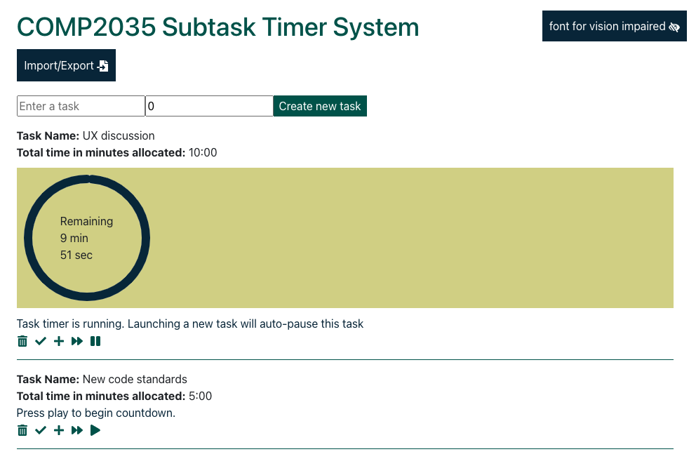

## Pausing, extending and advancing tasks

Once a task has been selected by a user as the current task by pressing the ‘play’ icon, a task will become the current task, and the timer will begin (or resume). Users can pause the progress of the current task by clicking the ‘pause’ icon (the ‘pause’ icon will be toggled with the ‘play’ button, depending on the state of the timer). Users can add 1 minute to the current timer by clicking the ‘plus’ icon, or advance (i.e. subtract from) the current timer by clicking the ‘fast-forward’ icon.

## Audio cue for completed tasks

When a current timer has reached 0, an audio cue will play a ‘ding’ sound to indicate the timers’ completion.

## Ticking off and Rating tasks

A user can ‘tick-off’ a task by pressing the 'tick' icon and the system will prompt the user to rate the efficiency of the discussion of that particular task. This is achieved by hovering over the desired star rating and clicking.

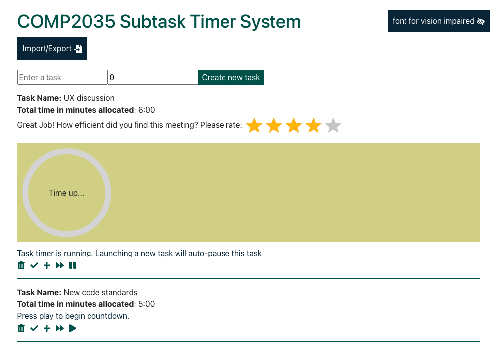

## Accessibility for vision impaired

A user can toggle the font size of task information by clicking on the 'font size' button on the top right

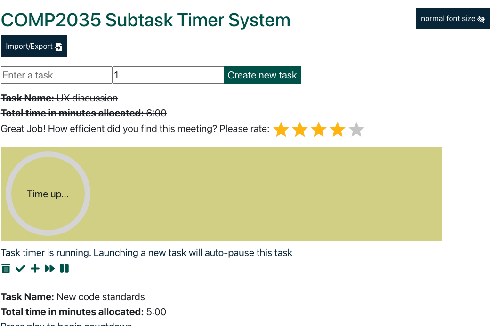

## Import tasks

A user can import tasks from a _CSV_ file.
File should have the following headers:

- **task**
- **time**

Here you can find an [import file example](file-examples/import_example.csv).

1. Click the _Import/Export_ button

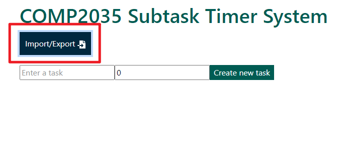

2. Choose a file to import

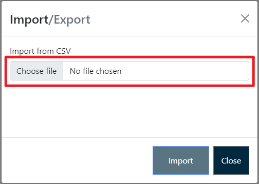

3. Click the import button

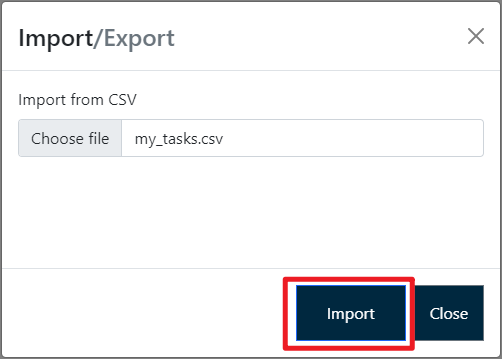

## Export tasks

A user can export tasks as a _CSV_ file. They can either download it or send via e-mail.

**Navigate to the export tab:**

1. Click the _Import/Export_ button

2. Click _Export_

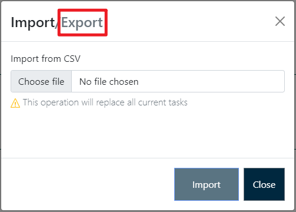

Now user has an option either to _download_ tasks or _send them via email_.

### Download

_Download_ option is selected by default. Click the download button to complete the import.

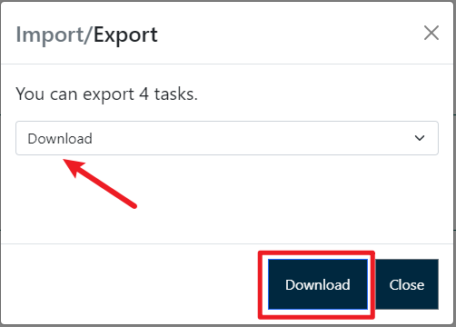

### Send via e-mail

This project sends emails via google account. Another SMTP service can be specified in `server/server.properties` file.

1. Select _Send via E-mail_ option in the drop-down list

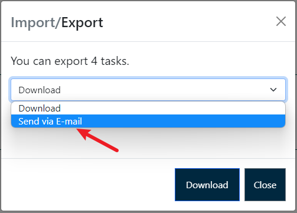

2. Enter the recipient's e-mail.

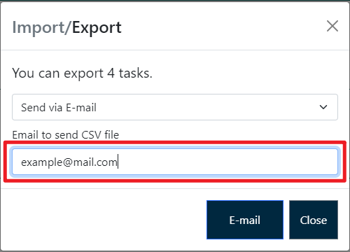

3. Click the _E-mail_ button.

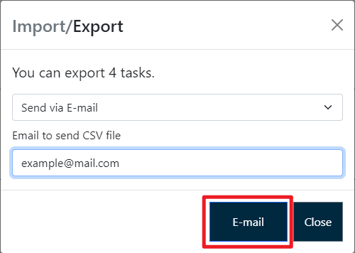
